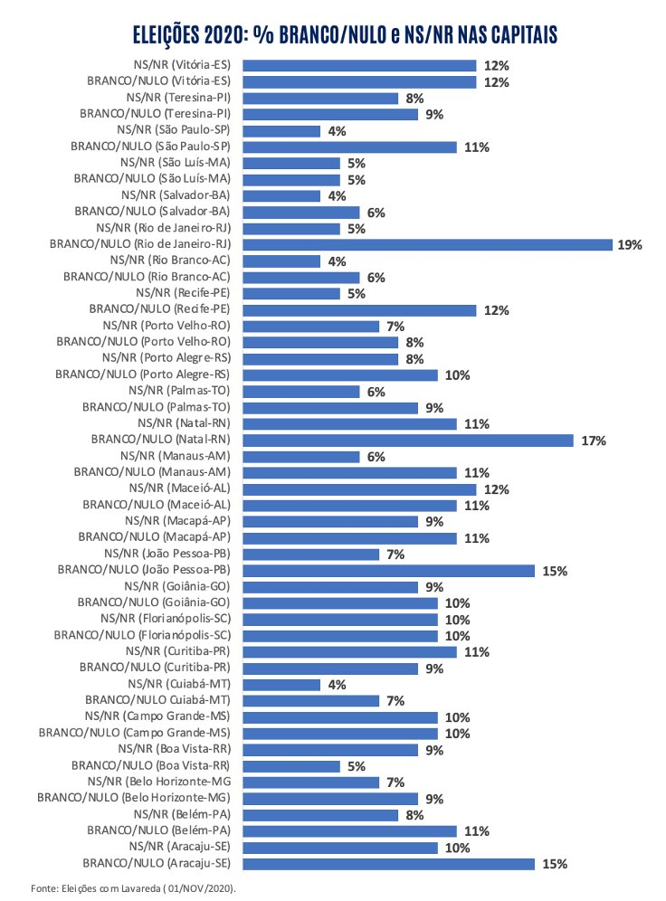

```{r setup, include=FALSE}
knitr::opts_chunk$set(echo = T,eval=T)
lapply(c("tidyverse","haven","lubridate","janitor","readxl",
                     "stringr","knitr", "magrittr","srvyr","survey","rvest"),require,character.only=T)
```
## Rode seus pacotes!

```{r,eval=F}
lapply(c("tidyverse","haven","lubridate",
         "janitor","readxl",
          "stringr", "magrittr","srvyr",
         "survey"),require,character.only=T)
```


# Revendo conteúdos da última aula - gráficos

## Refazendo um gráfico feio



## Ficou feio mesmo


## Então bora melhorar

LIVE CODING

```{r,warning=FALSE,message=FALSE}
source("dados/brincando_graficos.R")
```

##

```{r,echo=F,warning=FALSE,message=F,fig.height=7,fig.width=4}
plot
```


## onde estamos?


# RMarkdown

## O que é?

- Comunicar com os tomadores de decisão, 

  -- que querem se concentrar nas conclusões, não no código por trás da análise.

- Colaborar com outros cientistas de dados, 

  -- interessados em suas conclusões e como você as alcançou (ou seja, o código).

- um caderno de laboratório moderno, 

  -- onde você pode anotar não apenas o que fez, mas também o que pretende.

O R Markdown integra vários pacotes R e ferramentas externas. então, use o cheatsheets:

[R Markdown Cheat Sheet](https://github.com/rstudio/cheatsheets/raw/master/rmarkdown-2.0.pdf)

[R Markdown Reference Guide](https://www.rstudio.com/wp-content/uploads/2015/03/rmarkdown-reference.pdf)

##


##


## Lógica, instalação e recursos adicionais

- Pandoc e knitr

- LaTeX


## O básico

Cabeçalho

  -- opções e possibilidades

Escrita

Chunks

  -- opções
  -- nomes

Formatos de saída

## Saídas

Documentos estáticos

Documentos Interativos

Dashboards

Apresentações

Livros

Sites

Modelos


##

[Site do RMarkdown](https://rmarkdown.rstudio.com/)

IMPORTANTE!

[Galeria para replicação](https://rmarkdown.rstudio.com/gallery.html)


## Documentos

- HTML documents for web publishing.

- PDF documents for printing. Example Code

- Microsoft Word documents for Office workflows.

- Tufte styled documents for handouts.


## Documentos Interativos


- Combine R Markdown with htmlwidgets or the shiny package to make interactive documents.

- Add interactive graphics with htmlwidgets, such as the leaflet map widget.

- Embed htmlwidgets such as dygraphs and datatables directly into your reports.

- Shiny components and htmlwidgets will work in any HTML based output, such as a file, slide show or dashboard.

## Dashboards

- Use flexdashboard to create dashboards with gauges and value boxes.

- Add interactive graphics to a dashboard with htmlwidgets.

- Organize dashboards around a storyboard.

## Apresentações

- Create pdf slides with Beamer.

- Create HTML-based slides with Slidy.

- Create HTML-slides with ioslides.

- Create HTML-based slides with reveal.js. 

## Livros

[O próprio Cookbook](https://bookdown.org/yihui/rmarkdown-cookbook/)

## Sites
R Markdown makes it easy to build webpages straight from .Rmd files.

- The R Markdown website is itself built with R Markdown. Example Code.

- flexdashboard extends R Markdown to make administrative dashboards. Its website is also built from R Markdown. Example Code.

- Bookdown extends R Markdown to make books. Its website is built with R Markdown and CSS styling. Example Code.

- profvis provides profiling tools for R code, as well as a website made with R Markdown. Example Code.

## Modelos

- The JSS article template in the rticles package formats an R Markdown document to meet the style guidelines of the Journal of Statistical Software. Example Code

- The rjournal article template in the rticles package formats an R Markdown document to meet the style guidelings of the R Journal. Example Code

- The skeleton template is one of several provided in Bob Rudis’ markdowntemplates package. Example Code

- Steve Miller’s CV template formats an R Markdown file into a Curriculum Vitae (CV). Example Code


# Live Coding

## Paper em pdf

RAP - Usando bibliografia

[PDAD](http://www.codeplan.df.gov.br/wp-content/uploads/2020/06/Itapo%C3%A3.pdf)

## Relatório em html

[Compras públicas](http://www.codeplan.df.gov.br/wp-content/uploads/2018/02/Cartografia-das-compras-p%C3%BAblicas-de-bens-e-servi%C3%A7os-privados-no-DF.html)

[ANIPES](https://rpubs.com/fredbsr/ANIPES)

## Slides em html

Usando CSS

[Apresentação COVID](https://github.com/fredbsr/covid19br_OP)
