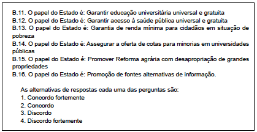
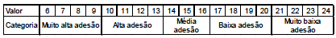
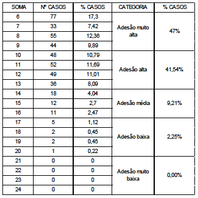
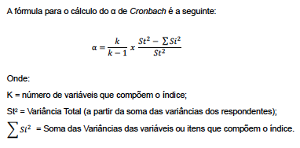
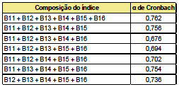
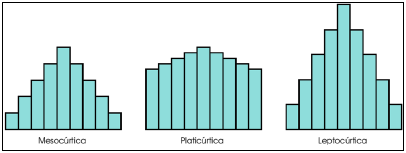

```{r setup, include=FALSE}
knitr::opts_chunk$set(echo = T,eval=T,warning = F,message = F,comment = F)
lapply(c("tidyverse","haven","lubridate","janitor","readxl",
                     "stringr","knitr", "magrittr","srvyr","survey","rvest","dataMaid"),require,character.only=T)
```

# Revendo conteúdos da última aula - RMarkdwon

## .rmd do zero e gh-pages

# Dados, Indicadores e escalas

## Matriz de dados

```{r}
# Atribuindo o dataframe de exercicio
dfe <- read_rds("dados/dfe.rds")
#
```

## dataMaid

```{r}
# Codebook dataMaid -- explicar
attr(dfe$id, "label") <- "Identificação"
attr(dfe$id, "shortDescription") <- "Variável de identificação do aluno"

attr(dfe$media, "shortDescription") <- "Nota do aluno ao final da disciplina"
attr(dfe$faltas, "shortDescription") <- "Total de faltas ao longo do semestre"
attr(dfe$turma, "shortDescription") <- "Turma do aluno"
attr(dfe$idade, "shortDescription") <- "Variável de identificação do aluno"
attr(dfe$interess, "shortDescription") <- "Variável de identificação do aluno"
attr(dfe$tempocup, "shortDescription") <- "Variável de identificação do aluno"
attr(dfe$escola, "shortDescription") <- "Variável de identificação do aluno"
attr(dfe$estcivil, "shortDescription") <- "Estado civil do aluno"

# makeCodebook(dfe,file = "cb_dfe.pdf")
```

[R Ladies - dataMaid](http://biostat.mc.vanderbilt.edu/wiki/pub/Main/MollyOlson/R-ladies-datamaid.html)


## Índices e escalas

Ordinais

 - Escala
 
  -- Atribuições ao padrão de resposta
  
  -- Pode conter vários itens

 - Índice 
  
  -- Compostos por itens (multidimensional)

  -- cada item é uma variável

 
## Critérios

- Validade (interna e externa)

- Variância

- Correlação (bivariada e multivariada)

- Outras propriedades consagradas (Januzzi)

##


## tribuição de pontos

Escalas de respostas

 - amplitude

 - Não resposta

 - pesos
 
## Tipos

 - Likert
 
 - Feeling thermometer

Menos conhecidas (e utilizadas)

 - Bogartus (distância social)
 
 - Thurstone
 
 - Guttman
 
 

## Testes de confiabilidade - Cronbach

Exemplo Cervi



##



##



## Princípios

- Criterion-related

- Content

- Construct

Lógica:

$$x = t + e $$

Onde:

$x$ é a medida empírica a ser estudada

$t$ é a parte explicada da variação

$e$ é o erro randômico (aleatório)

Vamos olhar isso melhor em inferência.

## Fórmula



## Cronbach

Usando o pacote psych

```{r}
r4 <- psych::sim.congeneric()
crb <- psych::alpha(r4)
summary(crb)
```

##



## Mais info

[Pacote psych](http://personality-project.org/r/psych/)

[Consistência Interna](https://www.r-bloggers.com/2016/08/five-ways-to-calculate-internal-consistency/)


## Indicadores estatísticos

Razão: $Z=X/Y$

Proporção: $Z=X/(Y+X)$

Percentagem: $Proporção*100$

Taxa: $eventos/exposição ao risco$

# Indicadores parlamentares e eleitorais


## Parlamentares - Índice de fracionalização


## Parlamentares - Índice de fracionalização máxima


## Parlamentares - Índice de fragmentação


## Parlamentares - Número efetivo de partidos


## Parlamentares - Renovação


## Eleitorais


## Mais recursos

[psData](https://github.com/rOpenGov/psData)

[rOpenGov](http://ropengov.github.io/projects/)

[QoG](http://ropengov.github.io/rqog/)

[electoral](https://cran.r-project.org/web/packages/electoral/index.html)

## Representações descritivas de dados - Tabela

```{r}
# Com tabyl
dfe %>%
  drop_na(interess,estcivil) %>% # retirando NAs
  janitor::tabyl(interess,estcivil) %>% # tabela cruzada
  janitor::adorn_percentages("col") %>%
  janitor::adorn_pct_formatting()
```


## Representações descritivas de dados - Histograma

```{r,fig.height=4}
dfe %>%
  ggplot() +
  geom_histogram(aes(media),bins=4)
```


## Representações descritivas de dados - Gráfico de dispersão

```{r,fig.height=4}
dfe %>%
  ggplot(aes(y=media,x=idade)) +
  geom_point() +
  geom_smooth(method="lm")
```

## Representações descritivas de dados - Binário 

```{r,fig.height=4}
dfe %>%
  drop_na() %>%
  ggplot() +
  geom_bar(aes(fill=estcivil,y=estcivil),position = position_stack(reverse = TRUE),stat = "count")
  
```


## Representações descritivas de dados - Box plot

```{r,fig.height=4}
dfe %>%
  drop_na() %>%
  ggpubr::ggboxplot(x="estcivil",y="idade",fill = "estcivil")
```


# Medidas de posição

## Medidas de posição 

As medidas de posição trazem informação sobre a localização dos dados no seu conjunto de possíveis valores.

## Média aritmética

A média aritmética é definida pela soma das observações dividida pelo número total de observações.

Exemplo: sejam $x_1, ..., x_n$ $n$ observações de uma variável $X$ qualquer. A média é dada pela expressão

$\frac{\sum_{i=1}^{n}x_i}{n} = \frac{x_1 + x_2 + ... + x_n}{n}$

No R:
```{r}
dfe %>%
  pull(media) %>%
  mean(na.rm=T)
```


## Média ponderada

## Mediana

A mediana é a observação que ocupa a posição central dos dados.

Exemplo 1 (número ímpar de observações): vamos considerar o seguinte conjunto de observações: 3, 7, 10, 5, 2, 1, 1.

Para calcular a mediana, primeiramente ordenamos os dados: 1, 1, 2, 3, 5, 7, 10.

É fácil verificar que a observação que ocupa a posição central é o valor 3. Portanto, 3 é a mediana desse conjunto de valores.

Exemplo 2 (número par de observações): vamos considerar agora o seguinte conjunto de observações: 15, 3, 2, 0, 9, 17.

Ordenanando os dados, temos: 0, 2, 3, 9, 15, 17.

Neste caso, a mediana será dada pela média entre as duas observações centrais, isto é, (3 + 9)/2 = 6.

## Moda

A moda é a observação mais frequente do conjunto de valores observados.

Exemplo: no conjunto de observações {3, 5, 10, 11, 11, 20}, a observação 11 aparece 2 vezes enquanto as demais apenas 1 vez. Portanto, 11 é a moda desse conjunto.

# Medidas de dispersão

## Medidas de dispersão 

O resumo de um conjunto de dados por uma única medida de posição central não traz informação sobre a variabilidade das observações.

Um critério frequentemente usado para avaliar a dispersão de um conjunto de observações é aquele que mede a dispersão dos dados em torno da sua média.

##

```{r}
dfe %>%
  ggplot() +
  geom_density(aes(fill=turma,x=media),alpha=.5,color=NA) +
  geom_vline(data=.%>%group_by(turma)%>%
               summarise(media=mean(media,na.rm=T)),
             aes(color=turma,xintercept=media))
  

```


## Amplitude e Quantis

Amplitude = valor máximo - valor mínimo


A mediana é uma medida que deixa metade dos dados abaixo dela e metade acima. De modo geral, podemos definir a medida $q_p$, $0 < p < 100$, tal que $p%$ das observações sejam menores que $q_p$. Esta medida é chamada de quantil de ordem $p$.

Alguns quantis são bastante utilizados na prática. São eles

$Q1 = q_{25\%}$ (primeiro quartil)

$Q2 = q_{50\%}$ (mediana)

$Q3 = q_{75\%}$ (terceiro quartil)

Observe que os $q_{0\%}$ e $q_{100\%}$ denotam, respectivamente, o mínimo e o máximo de conjunto de dados.


## Variância

Sejam $x_1, x_2, ..., x_n$ $n$ observações de uma variável quantitativa $X$. Seja $\bar{x}$ a média dessas observações.

Vamos observar, então, os desvios das observações em relação à média $\bar{x}$, isto é, $x_i - \bar{x}$, para $i = 1, ..., n$.

**Ideia 1**: usar como medida de dispersão a soma desses desvios, isto é,

$$
\sum_{i=1}^{n}(x_i - \bar{x}).
$$

**Problema 1**: para qualquer conjunto de observações 

$$
\sum_{i=1}^{n}(x_i - \bar{x}) = 0.
$$

**Ideia 2**: considerar a soma do quadrado dos desvios, dada por 

$$
\sum_{i=1}^{n}(x_i - \bar{x})^2
$$

**Problema 2**: não podemos comparar conjuntos de observações de tamanhos diferentes.

**Ideta 3**: utilizar a média desses desvios quadráticos. 

Sendo assim, definimos a medida de dispersão conhecida como **variância** da seguinte forma:

$$
VAR(X) = \frac{\sum_{i=1}^{n}(x_i - \bar{x})^2}{n}
$$

## Desvio padrão

A utilização da variância como medida de dispersão pode ainda causar um problema de interpretação, pois a sua dimensão é igual ao quadrado da dimensão dos dados. Sendo assim, costuma-se usar o desvio padrão, definido por

$DP(X) = \sqrt{VAR(X)} = \sqrt{\frac{\sum_{i=1}^{n}(x_i - \bar{x})^2}{n}}$


## Coeficiente de variação

Medida relativa -> que proporção da média é o desvio-padrão

$\frac{dp}{média}$

## Medidas de assimetria e curtose




Coeficiente de Assimteria de Pearson = $média - moda$

Assimetria adimensional = $\frac{média - moda}{dp}$

Coeficiente quartílico de assimetria = $3*\frac{média-mediana}{dp}$

# Surveys e planejamento

