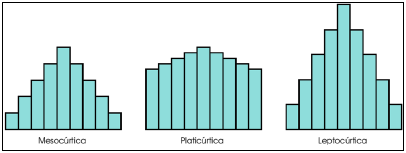
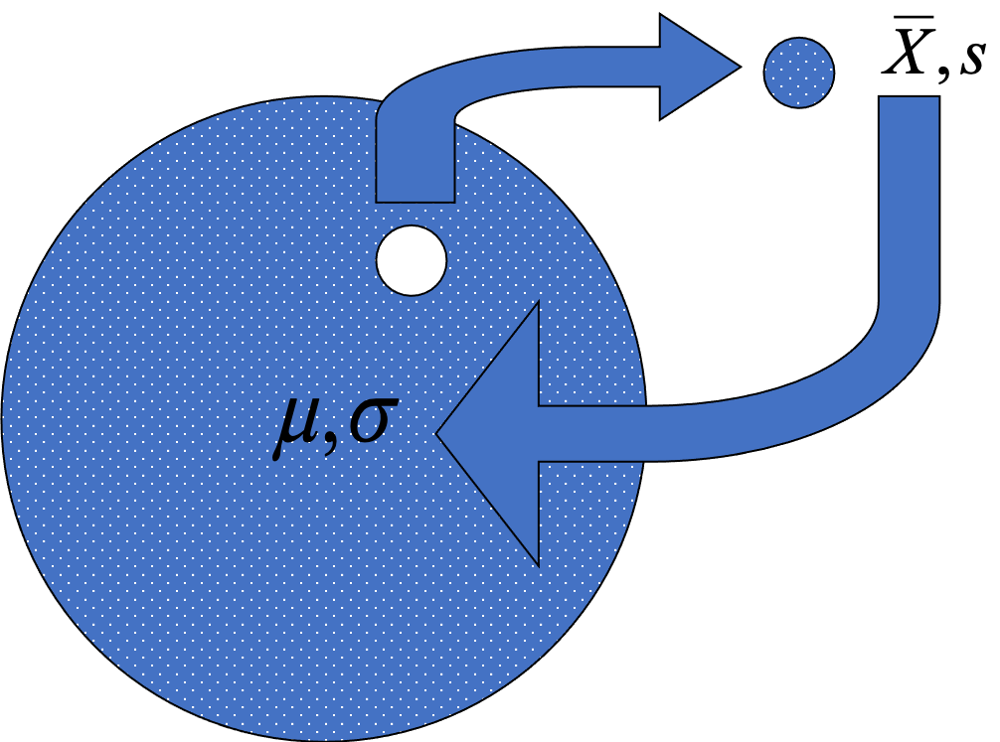
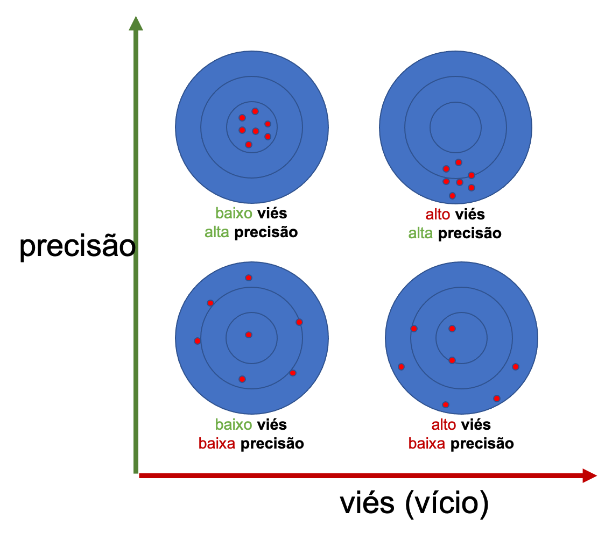
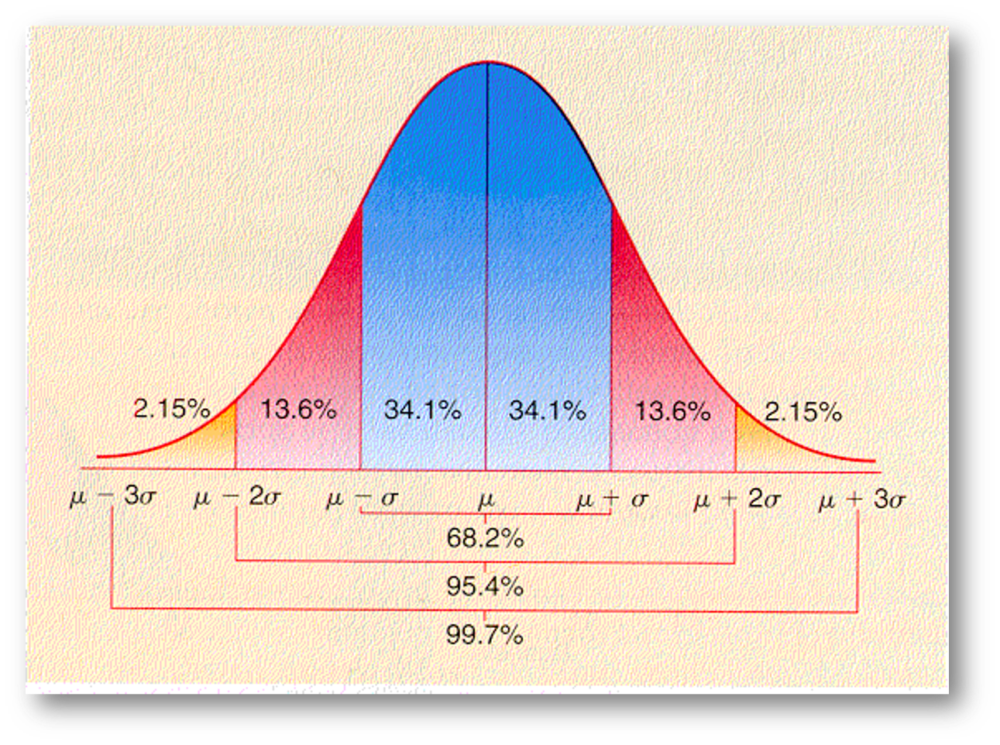
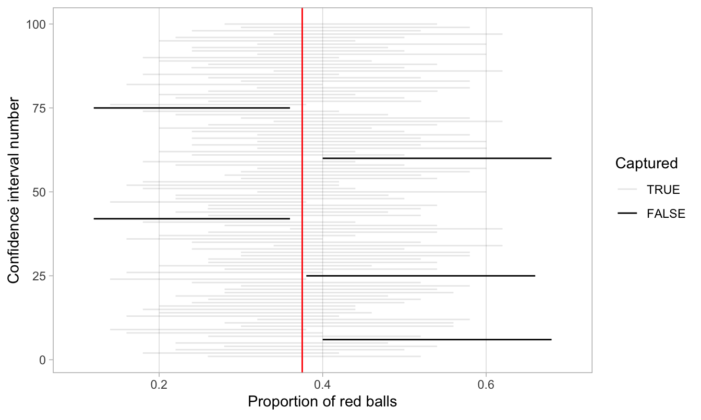
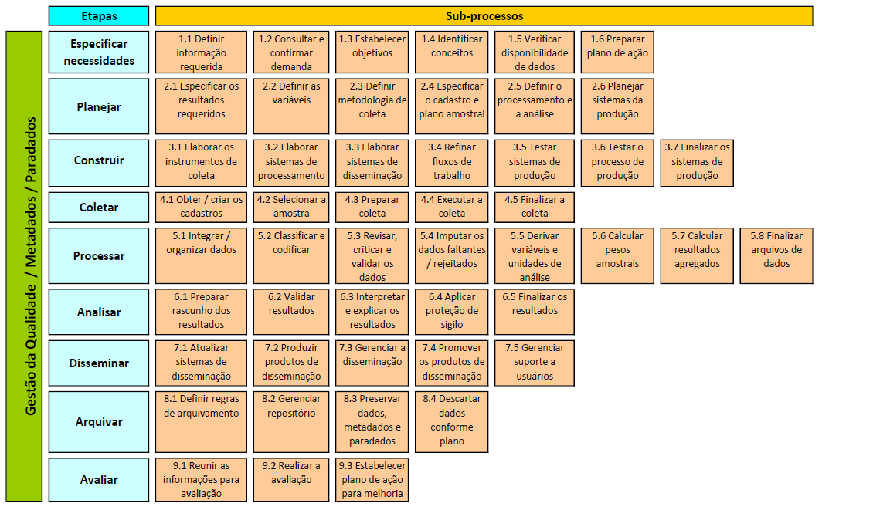
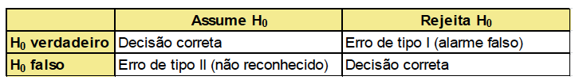

```{r setup, include=FALSE}
knitr::opts_chunk$set(echo = T,eval=T,warning = F,message = F,comment = '')
lapply(c("tidyverse","janitor","readxl","patchwork","infer","moderndive",
                     "stringr","knitr", "magrittr"),require,character.only=T)
dfe <- read_rds("dados/dfe.rds")
```


# Medidas-resumo


Nós vimos como utilizar gráficos e tabelas para visualizar dados e relações entre eles. Além de gráficos, queremos uma descrição numérica que mensure certas características importantes dos dados. 

Medidas resumos são números que nos dão uma ideia de certas características de interesse dos dados. Elas podem ser pensadas como um passo além dos gráficos, reduzindo ainda mais a informação dos dados até chegar em um número.


## Classificação

Medidas resumo podem ser de dois tipos:

- Medidas de posição ou de tendência central

- Medidas de dispersão

Medidas de posição nos dão uma ideia de um valor em torno do qual os dados se agrupam. Elas nos trazem uma ideia da grandeza dos dados.

Medidas de dispersão nos dizem quanto os dados estão próximos ou distantes uns dos outros (e da medida de posição). Elas nos dão uma ideia da semelhança dos dados.


# Medidas de posição 

Medidas de posição nos dão uma ideia de um valor em torno do qual os dados se agrupam. Elas nos trazem uma ideia da grandeza dos dados.

As medidas de posição são a média, a mediana, a moda e os quantis (em especial os quartis e os percentis)


## Moda

A moda é a observação mais frequente do conjunto de valores observados.

Exemplo: no conjunto de observações {3, 5, 10, 11, 11, 20}, a observação 11 aparece 2 vezes enquanto as demais apenas 1 vez. Portanto, 11 é a moda desse conjunto.

\scriptsize
Observação 1: Quando a variável é contínua, a tabela e o histograma são construídos com base em classes. A moda, portanto, será a classe que aparece com maior frequência. Alguns autores denominam esta classe de classe modal, sugerindo que ela não é a moda, mas sim a classe que contém a moda.

Observação 2: Algumas distribuições apresentam duas modas. Essas distribuições são chamadas de bimodais. De fato, distribuições podem ter um número qualquer de modas sendo chamadas de multimodais. O que significa um histograma de notas de prova bimodal?

\small
No R: não há uma função base R, pode-se usar o pacote `modeest`


## Média 

A média aritmética é definida pela soma das observações dividida pelo número total de observações.

Exemplo: sejam $x_1, ..., x_n$ $n$ observações de uma variável $X$ qualquer. A média é dada pela expressão

$\Large \frac{\sum_{i=1}^{n}x_i}{n} = \frac{x_1 + x_2 + ... + x_n}{n}$

No R:
```{r}
dfe %>%
  pull(media) %>%
  mean(na.rm=T)
```

Média ponderada - mesma ideia.


## Mediana

A mediana é a observação que ocupa a posição central dos dados.

**Exemplo 1** (número ímpar de observações): vamos considerar o seguinte conjunto de observações: 3, 7, 10, 5, 2, 1, 1.

Para calcular a mediana, primeiramente ordenamos os dados: 1, 1, 2, 3, 5, 7, 10.

É fácil verificar que a observação que ocupa a posição central é o valor 3. Portanto, 3 é a mediana desse conjunto de valores.

**Exemplo 2** (número par de observações): 15, 3, 2, 0, 9, 17.

Ordenanando os dados, temos: 0, 2, 3, 9, 15, 17.

Neste caso, a mediana será dada pela média entre as duas observações centrais, isto é, $(3 + 9)/2 = 6$.

No R:
```{r}
dfe %>%
  pull(media) %>%
  median(na.rm=T)
```

## Quantis

A mediana é uma medida que deixa metade dos dados abaixo dela e metade acima. De modo geral, podemos definir a medida $q_p$, $0 < p < 100$, tal que $p%$ das observações sejam menores que $q_p$. Esta medida é chamada de quantil de ordem $p$.

Alguns quantis são bastante utilizados na prática. São eles

$Q1 = q_{25\%}$ (primeiro quartil)

$Q2 = q_{50\%}$ (mediana)

$Q3 = q_{75\%}$ (terceiro quartil)

Observe que os $q_{0\%}$ e $q_{100\%}$ denotam, respectivamente, o mínimo e o máximo de conjunto de dados.

No R:
```{r}
dfe %>% pull(media) %>% quantile()
```


# Medidas de dispersão 

O resumo de um conjunto de dados por uma única medida de posição central não traz informação sobre a variabilidade das observações.

Um critério frequentemente usado para avaliar a dispersão de um conjunto de observações é aquele que mede a dispersão dos dados em torno da sua média.

## Amplitude 

Amplitude = valor máximo - valor mínimo

## Variância

Sejam $x_1, x_2, ..., x_n$ $n$ observações de uma variável quantitativa $X$. Seja $\bar{x}$ a média dessas observações.

Vamos observar, então, os desvios das observações em relação à média $\bar{x}$, isto é, $x_i - \bar{x}$, para $i = 1, ..., n$.

**Ideia 1**: usar como medida de dispersão a soma desses desvios, isto é,

$$ \Large
\sum_{i=1}^{n}(x_i - \bar{x}).
$$

##

**Problema 1**: para qualquer conjunto de observações 

$$ \Large
\sum_{i=1}^{n}(x_i - \bar{x}) = 0.
$$

**Ideia 2**: considerar a soma do quadrado dos desvios, dada por 

$$ \Large
\sum_{i=1}^{n}(x_i - \bar{x})^2
$$

##

**Problema 2**: não podemos comparar conjuntos de observações de tamanhos diferentes.

**Ideia 3**: utilizar a média desses desvios quadráticos. 

Sendo assim, definimos a medida de dispersão conhecida como **variância** da seguinte forma:

$$ \Large
var(X) = \frac{\sum_{i=1}^{n}(x_i - \bar{x})^2}{n}
$$

## Desvio padrão

A utilização da variância como medida de dispersão pode ainda causar um problema de interpretação, pois a sua dimensão é igual ao quadrado da dimensão dos dados. Sendo assim, costuma-se usar o desvio padrão, definido por

$$ \Large
dp(X) = \sqrt{var(X)} = \sqrt{\frac{\sum_{i=1}^{n}(x_i - \bar{x})^2}{n}}
$$


## Coeficiente de variação

Medida relativa -> que proporção da média é o desvio-padrão

$$ \Huge 
\frac{dp}{média}
$$


## vendo média, mediana e distribuições

```{r,fig.height=3}
dfe %>% ggplot() +
  geom_density(aes(fill=turma,x=media),alpha=.5,color=NA) +
  geom_vline(data= . %>% group_by(turma) %>%
               summarise(media_=mean(media,na.rm=T),mediana=median(media,na.rm = T)) %>% 
               dplyr::rename(media=media_) %>% pivot_longer(media:mediana) ,
             aes(color=turma,xintercept=value,linetype=name))
  
```


## Medidas de assimetria e curtose



Coeficiente de Assimteria de Pearson = $média - moda$

Assimetria adimensional = $\large\frac{média - moda}{dp}$

[pacote skimr](https://docs.ropensci.org/skimr/)


# Amostras


## Terminologia 1/n


*Unidade* é um único indivíduo, entidade ou objeto a ser medido ou observado na pesquisa.

*População* é o conjunto de todas as unidades para as quais se deseja fazer inferência.

*População alvo* é a parte da *População* para a qual se gostaria de obter informação. Seja um estudo sobre a fecundidade da *População* de uma determinada área geográfica. A *População Alvo* neste caso são apenas as mulheres em idade fértil.

*População de pesquisa* é a população a ser efetivamente coberta pela pesquisa. Algumas unidades ou grupos de unidades podem ser inacessíveis ou com custo-benefício que não se mostre interessante para a pesquisa. 

\scriptsize
Quando ocorrer diferença entre a *população alvo* e a *população de pesquisa*, o pesquisador responsável deve procurar medir essa diferença e tratar de revelar com clareza que partes da *população alvo* ficaram de fora da *população de pesquisa*, de modo a permitir que os usuários dos resultados da pesquisa possam avaliar a relevância e aderência dos resultados da pesquisa aos seus objetivos. A diferença entre a *população de pesquisa* e a *população alvo* dá origem aos chamados *erros de cobertura*. Pesquisas de boa qualidade adotam estratégias para eliminar ou minimizar tais erros.

## Terminologia 2/n
 
*Amostra* é o conjunto de unidades que selecionamos da *população de pesquisa* para medir ou observar através da pesquisa.

*Amostra efetiva* é o conjunto de unidades que selecionamos da *população de pesquisa* e para as quais conseguimos de fato obter / medir / observar as variáveis de interesse através da pesquisa.

*Cadastro* é uma lista contendo a identificação das unidades que compõem a *população de pesquisa*, de onde a amostra é selecionada. Algumas pesquisas podem utilizar mais de um cadastro para selecionar a correspondente amostra. 

*Unidade de referência* ou *unidade de investigação* ou *unidade de observação* é uma unidade (componente da população) sobre a qual são obtidas as informações de interesse da pesquisa.

*Unidade informante* ou *unidade de informação* é uma unidade que fornece a informação de interesse sobre uma ou mais unidades de referência.

*Unidade de análise* é uma unidade à qual a análise e inferência são dirigidas.

*Unidade de amostragem* é uma unidade que pode ser selecionada para a amostra numa das etapas do processo de amostragem.

*Domínio de análise / interesse* é um conjunto de unidades de análise especificado como de interesse para fins de sumarização de dados, tabulação, inferência ou análise.


##




## Propriedades dos estimadores




## Tipos de amostras

**Aleatória simples:** sorteio simples de indivíduos dentro de uma população.

**Sistemática:** sorteio dentro de listas aleatoriamente atribuídas.

**Estratificada:** divide em estratos (características) e sorteia dentros dos estratos.

**Por conglomerados:** seleção de unidades geográficas.

**Por cotas:** *(NÃO PROBABILÍSTICA)* atingimento de percentuais pré-estabelecidos, com base na população.


## Um jogo com bolas vermelhas - tigela com 2.400 bolinhas


## Um jogo com bolas vermelhas - pá que pesca 50 bolinhas


## Proporção de bolinhas vermelhas - No R

```{r,fig.height=4}
library(moderndive)
tactile_prop_red %>% ggplot(aes(x = prop_red)) +
  geom_histogram(binwidth = 0.05, boundary = 0.4, color = "white") +
  scale_y_continuous(breaks = c(1:10)) +
  labs(x = "% de bolas vermelhas entre as 50 sorteadas",y = "Frequência",title="33 alunos") 
```


## Uma pá virtual usada 33 vezes

```{r}
pa_virtual <- bowl %>% 
  rep_sample_n(size = 50)

pa_virtual %>% 
  dplyr::summarise(num_red = sum(color == "red")) %>% 
  dplyr::mutate(prop_red = num_red / 50)

amostra_virtual <- bowl %>% 
  rep_sample_n(size = 50, reps = 33)

virtual_prop_red <- amostra_virtual %>% 
  dplyr::group_by(replicate) %>% 
  dplyr::summarise(red = sum(color == "red")) %>% 
  dplyr::mutate(prop_red = red / 50)

```


## 33 amostras

```{r,fig.height=3.5}
virtual_prop_red %>% ggplot(aes(x = prop_red)) +
  geom_histogram(binwidth = 0.05, boundary = 0.4, color = "white") +
  scale_y_continuous(breaks = c(1:10)) +
  labs(x = "% de bolas vermelhas entre as 50 sorteadas",y = "Frequência",
       title="33 pás virtuais") 
```


## 1000 amostras

```{r}
amostra_virtual <- bowl %>% 
  rep_sample_n(size = 50, reps = 1000)

virtual_prop_red <- amostra_virtual %>% 
  dplyr::group_by(replicate) %>% 
  dplyr::summarise(red = sum(color == "red")) %>% 
  dplyr::mutate(prop_red = red / 50)

```

## 1000

```{r,fig.height=3.5}
virtual_prop_red %>% ggplot(aes(x = prop_red)) +
  geom_histogram(binwidth = 0.05, boundary = 0.4, color = "white") +
  labs(x = "% de bolas vermelhas entre as 50 sorteadas",y = "Frequência",
       title="1000 pás virtuais") 
```


## Agora usando pás de tamanhos diferentes


```{r echo=FALSE}
# n = 25
virtual_samples_25 <- bowl %>%
    rep_sample_n(size = 25, reps = 1000)

virtual_prop_red_25 <- virtual_samples_25 %>%
  dplyr::group_by(replicate) %>%
  dplyr::summarize(red = sum(color == "red")) %>%
  dplyr::mutate(prop_red = red / 25) %>%
  dplyr::mutate(n = 25)
# n = 50
virtual_samples_50 <- bowl %>%
    rep_sample_n(size = 50, reps = 1000)

virtual_prop_red_50 <- virtual_samples_50 %>%
  dplyr::group_by(replicate) %>%
  dplyr::summarize(red = sum(color == "red")) %>%
  dplyr::mutate(prop_red = red / 50) %>%
  dplyr::mutate(n = 50)
# n = 100
virtual_samples_100 <- bowl %>%
    rep_sample_n(size = 100, reps = 1000)

virtual_prop_red_100 <- virtual_samples_100 %>%
  dplyr::group_by(replicate) %>%
  dplyr::summarize(red = sum(color == "red")) %>%
  dplyr::mutate(prop_red = red / 100) %>%
  dplyr::mutate(n = 100)

virtual_prop <- bind_rows(
  virtual_prop_red_25,
  virtual_prop_red_50,
  virtual_prop_red_100
)
comparing_sampling_distributions <- ggplot(virtual_prop, aes(x = prop_red)) +
  geom_histogram(binwidth = 0.05, boundary = 0.4, color = "white") +
  labs(
    x = "% de bolinhas vermelhas"
  ) +
  facet_wrap(~n)

comparing_sampling_distributions
```


## 


```{r, echo=FALSE}
comparing_n_table <- virtual_prop %>%
  dplyr::group_by(n) %>%
  dplyr::summarize(sd = sd(prop_red))

comparing_n_table 

```


Erro padrão: 
$$ 
\Huge
SE=\frac{SD}{\sqrt{n}} 
$$


## Teorema Limite Central

O TLC implica que, para amostras grandes, a média amostral terá distribuição normal independentemente da distribuição da variável de interesse na população. Isto implica que, se tivermos uma amostra grande, a distribuição amostral da média se aproximará de uma distribuição normal.

Quanto é “um número grande”?
Regra de bolso: pelo menos 30.
Se o número de elementos na amostra for menor que 30, a distribuição amostral da média só será normal se a população tiver distribuição normal.


[Coelhos, Dragões e o mundo "normal"](https://www.youtube.com/watch?v=jvoxEYmQHNM&feature=youtu.be)

## O mundo normal



## Recapitulando

- Padronização, tabelas, t de student... 
$$
\Huge
z=\frac{x-\mu}{\sigma}
$$

# Estimativas intervalares

Deseja-se estimar a proporção de bolinhas vermelhas na tigela. Recolhe-se uma amostra de 100 bolinhas e verifica-se que esta amostra tem média amostral 0.379 e desvio padrão 0,04.

Para estimar a proporção na tigela, dispõem-se de duas formas gerais de estimação:

Estimação por ponto: fornecemos um número que, acreditamos, estará perto da proporção. Que número seria esse?

Estimação por intervalo: fornecemos um intervalo que, com determinado nível de confiança, conterá o valor real da proporção.

##



## Intervalos de confiança

Vamos supor que $X_1, ..., X_n$ seja uma a. a. da v. a. $X \sim N(\mu, \sigma^2)$. A partir desta amostra, queremos construir um intervalo de confiança para $\mu$, isto é, um intervalo que tenha grande probabilidade de conter o verdadeiro valor de $\mu$.

Sabemos que $\bar{X}$ é um bom estimador para $\mu$. Sendo assim, é razoável pensar em minimizar o erro dado por

$$
\text{erro } = |\bar{X} - \mu|.
$$

Mais precisamente, podemos que a probabilidade desse erro ser menor que um determinado $\epsilon$ seja grande, digamos, 95%. Simbolicamente, temos

$$
P(|\bar{X} - \mu| < \epsilon) = 95\%.
$$

##

Desenvolvendo a expressão anterior, temos que

$$
P(\bar{X} - \epsilon < \mu < \bar{X} + \epsilon) = 95\%.
$$

Portanto, um intervalo para $\mu$ com *confiança* de 95% é dado por $(\bar{X} - \epsilon, \bar{X} + \epsilon)$. Não é difícil mostrar que, neste caso,

$$
\epsilon = z(95\%) \sqrt{\frac{\sigma^2}{n}},
$$
em que $z(95\%)$ é o número que satisfaz 

$$
P(-z(95\%) < Z < z(95\%)) = 95\%.
$$

## 

Neste contexto, o valor $95\%$ é chamado *nível de confiança* do intervalo. Em um caso geral, denotando essa quantidade por $\gamma$, o intervalo de confiança para a média $\mu$ é dado por

$$
IC(\mu, \gamma) = \left(\bar{X} - z(\gamma) \sqrt{\frac{\sigma^2}{n}}, \bar{X} + z(\gamma) \sqrt{\frac{\sigma^2}{n}}\right).
$$

## Escrito de forma mais simples e adequado a proporções

Limite superior $=\bar{X} + z * SE$

Limite inferior $=\bar{X} - z * SE$


## Tamanho da amostra - a gente não vai fazer isso

$$
n=\frac{z^{2} .(p . q)}{e^{2}}
$$
$$
n=\left(\frac{t . s}{e}\right)^{2}
$$

## Margem de erro

$$
e=z . \sqrt{\frac{p . q}{n}}
$$

# Surveys e planejamento





# Inferência e testes de hipótese

Modelos probabilísticos e normal

Hipóteses e testes de hipóteses (NHST)

##

