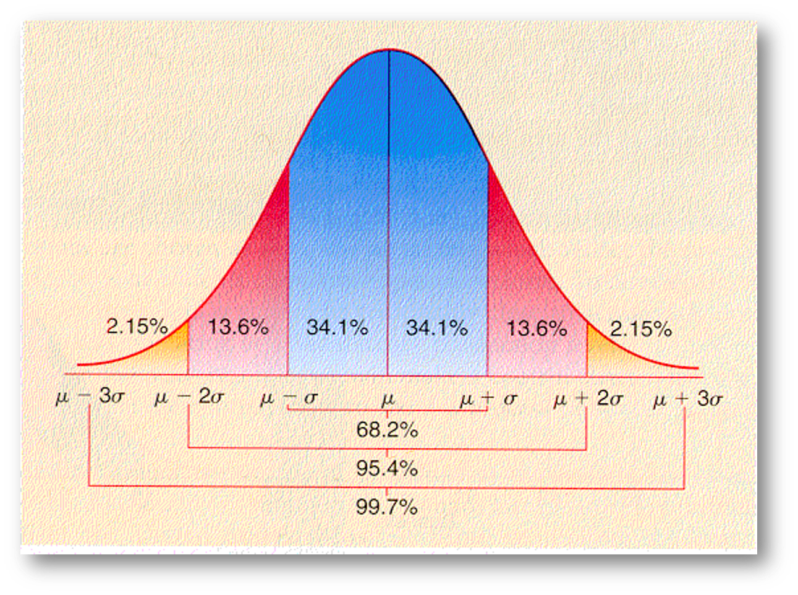

```{r setup, include=FALSE}
knitr::opts_chunk$set(echo = T,eval=T,warning = F,message = F,comment = '')
lapply(c("tidyverse","janitor","readxl","patchwork","infer","moderndive","kableExtra","scales",
         "nycflights13","ggplot2movies","patchwork","viridis","ggrepel","gt","effectsize",
                     "stringr","knitr", "magrittr"),require,character.only=T)
dfe <- read_rds("dados/dfe.rds")
```


# Vamos falar de surveys


Questionário


Erros não amostrais


Tipos de surveys


Estrutura


# Teste de hipóteses


Probabilidade, incerteza e o mundo normal

Padronização, tabelas, t de student... 




## Estimativa intervalar


## Teste de hipóteses


Uma **hipótese**  é uma declaração sobre o valor de um parâmetro desconhecido da população. 

Um **teste de hipótese **  consiste em testar duas hipóteses concorrentes: 

  -- (1) uma **hipótese nula** $H_0$ (pronuncia-se "H-zero") 
  
versus 
  
  -- (2) uma **hipótese alternativa** $H_A$ (também denotada $H_1$).

Geralmente, a hipótese nula é uma afirmação de que "não há efeito" ou "não há diferença de interesse". 

Em muitos casos, a hipótese nula representa o status quo ou uma situação em que nada de interessante está acontecendo. A hipótese alternativa  é a afirmação que o experimentador ou pesquisador deseja estabelecer ou encontrar evidências para apoiar. É vista como uma hipótese "desafiadora" à hipótese nula $H_0$. 

## Erros

1. Analogia com um julgamento:
```{r,results='asis',echo=F}
tibble (
  Veredito  = c ( "Inocente" , "Culpado" ),
  `Verdadeiramente inocente`  = c ( " Correto " , " Erro Tipo I " ),
  `Verdadeiramente culpado`  = c ( " Erro Tipo II " , " Correto " )
) %>%
  knitr::kable(format = "latex")
```

.

2. Nossos testes:
```{r,results='asis',echo=F}
tibble (
  `Decisão`  = c ( "Não rejeita H0 " , " Rejeita H0 " ),
  `H0 verdadeiro`  = c ( " Correto " , " Erro Tipo I " ),
  `HA verdadeiro`  = c ( " Erro Tipo II " , " Correto " )
) %>%
  knitr::kable(format = "latex")
```


# Só existe um tipo de teste?

Ao testar hipóteses, você segue este padrão:

Etapa 1: **Calcular $\delta$** É com isso que você se preocupa: a diferença de médias, a média, a mediana, a proporção, a diferença de proporções etc. Você está testando para ver se esse número é significativamente diferente de zero (ou de algum outro número) .

Etapa 2: **inventar o mundo onde $\delta$ é nulo.** Simule como seria o mundo se não houvesse diferença entre os dois grupos, ou se não houvesse diferença nas proporções, ou se o valor médio fosse um número específico.

Etapa 3: **observe $\delta$ no mundo nulo.** Coloque a estatística da amostra no mundo nulo e veja se ela se encaixa bem.

Etapa 4: **calcule a probabilidade de que $\delta$ poderia existir em um mundo nulo.** Este é o seu valor p, ou a probabilidade de ver um $\delta$ pelo menos tão alto em um mundo onde não há efeito.

Etapa 5: **decida se $\delta$ é estatisticamente significativo.** Escolha algum padrão de evidência ou limite para decidir se há provas suficientes para rejeitar o mundo nulo. Os limites padrão (do menos ao mais rigoroso) são 0,1, 0,05 e 0,01.


## Estrutura geral do teste


##  "Existe apenas um teste" com infer


1.  `specify()` especifica as variáveis e interesse em seu quadro de dados.
1.  `hypothesize()` hipotetiza a hipótese nula $H_0$. Em outras palavras, defina um "modelo para o universo" supondo que $H_0$ seja verdadeiro.
1.  `generate()` re-amostra assumindo que $H_0$ é verdadeiro. Em outras palavras, *simula* dados assumindo que $H_0$ é verdadeiro.
1.  `calculate()` calcula a *estatística de teste* de interesse, tanto para os dados observados quanto para seus dados *simulados*.
1.  `visualize ()` visualiza a *distribuição nula* resultante e calcula o *$p$-valor* comparando a distribuição nula com a estatística de teste observada.

Uma vez que você entenda essa estrutura geral, poderá entender *qualquer* teste de hipótese. Em uma postagem de blog famosa, o cientista da computação Allen Downey chamou isso de ["Há apenas um teste"](http://allendowney.blogspot.com/2016/06/there-is-still-only-one-test.html ).


## Pacote infer

Realizar inferência estatística usando uma gramática coerente com o tidyverse framework.

O pacote é centrado em 4 verbos principais, complementados com muitos utilitários para visualizar e extrair valor de seus resultados:

- `specify()` permite que você especifique a variável, ou relação entre as variáveis, na qual você está interessado.
- `hypothesize()` permite que você declare a hipótese nula.
- `generate()` permite gerar dados que refletem a hipótese nula.
- `calculate()` permite que você calcule uma distribuição de estatísticas a partir dos dados gerados para formar a distribuição nula.


## Nível de significância

```{r}
bootstrap_distribution <- pennies_sample %>% 
  specify(response = year) %>% 
  generate(reps = 1000) %>% 
  calculate(stat = "mean")
bootstrap_distribution
```


##

```{r}
percentile_ci <- bootstrap_distribution %>% 
  get_confidence_interval(level = 0.95, type = "percentile")
percentile_ci
```


##

```{r,fig.height=3.5}
visualize(bootstrap_distribution) + 
  shade_confidence_interval(endpoints = percentile_ci)
```


## Pacote srvyr

Live coding


# Testes

## unilateral

Testando a hipótese de que a média é maior que 7

```{r}
# Média dfe
media_turma <- dfe %>% 
  specify(media ~ NULL) %>%
  calculate(stat = "mean")

null_media <- dfe %>% 
  specify(media ~ NULL) %>%
  hypothesize(null = "point", mu = 70) %>%
  generate(reps = 1000) %>%
  calculate(stat = "mean")

null_media %>% get_p_value(obs_stat = media_turma, direction = "greater")
```

## Resultado gráfico

```{r,fig.height=4}
visualize(null_media) + shade_p_value(obs_stat = media_turma, direction = "greater")

```


## Diferenças de proporções

Live coding


## Teste Diferença de médias


Live coding


## usando t_test

```{r}
t_test_results <- dfe %>%
  t_test(
    formula = media ~ NULL,
    alternative = "greater",
    mu = 70
  )
t_test_results
```


## ANOVA

Vários grupos e uma medida quantitativa

Princípio: Teste F: $\Huge\frac{\text{Variância entre grupos}}{\text{Variância dentro dos grupos}}$

```{r}
ANOVAtest <- aov(data=dfe,formula = media ~ turma)

summary(ANOVAtest)

```


## Teste de Tukey

```{r,results='asis'}
Tt <- TukeyHSD(ANOVAtest)
Tt$turma %>% 
  as.data.frame() %>% rownames_to_column() %>%
  mutate(rowname = gsub("\n","",rowname)) %>%
  knitr::kable(col.names = c("","Dif.","Lim inf","Lim sup","p-valor"),
               digits=3,format = "latex")
```


