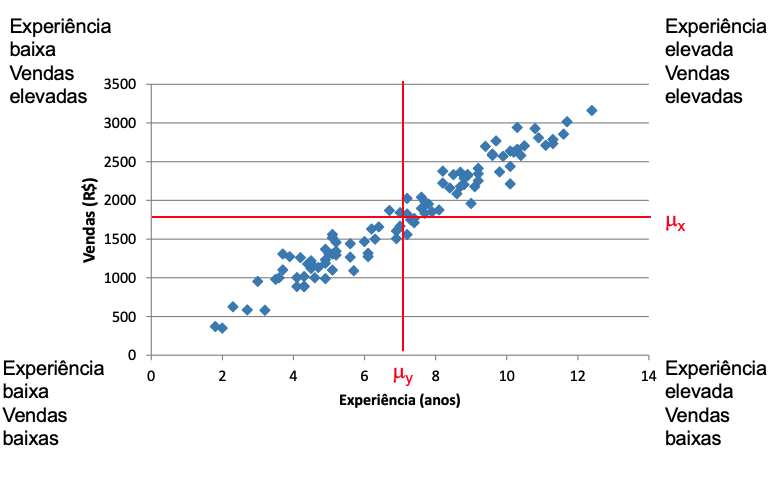
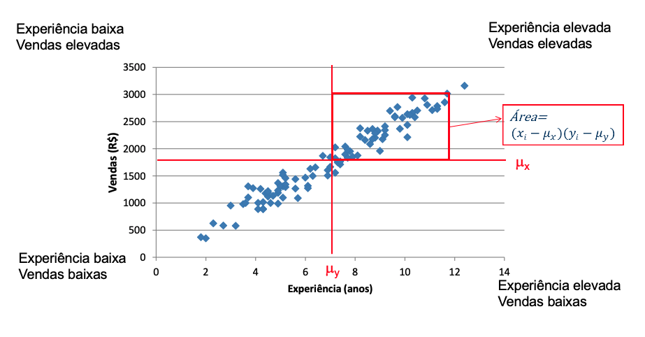
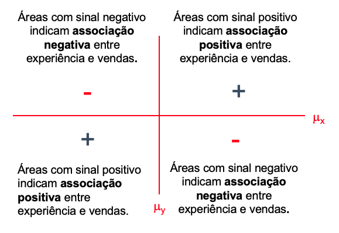
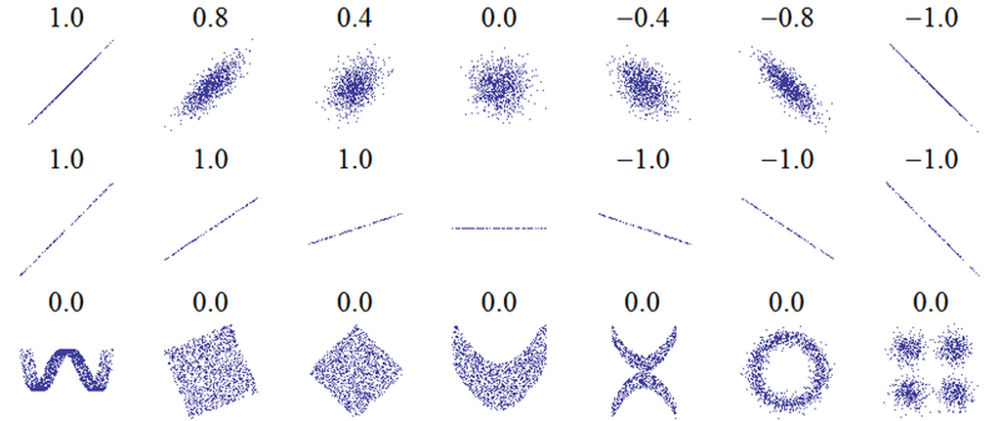

```{r setup, include=FALSE}
knitr::opts_chunk$set(echo = T,eval=T,warning = F,message = F,comment = '',fig.height = 3.5)
lapply(c("tidyverse","janitor","readxl","patchwork","infer","ggpubr","moderndive",
         "kableExtra","scales",
         "nycflights13","ggplot2movies","patchwork","viridis","ggrepel","gt","effectsize",
          "extrafont","hrbrthemes","stringr","knitr", "magrittr"),require,character.only=T)

loadfonts()

theme_ipsum_mod <- theme_ipsum() +
  theme(panel.spacing=grid::unit(.5, "lines"),
        plot.margin = ggplot2::margin(1, 1, 1, 1))

dfe <- read_rds("dados/dfe.rds") %>% 
  mutate(aleat=floor(runif(nrow(.),min=0, max=6)),
         nota1=media-aleat,
         nota2=media+aleat) %>% 
           dplyr::select(-aleat)
```

# Formalizando Hipóteses

## Um caso comum - Esta análise está correta?


## Comparação de médias

A resposta é não.  (por quê?)

Em todo caso, ela ilustra uma situação bem comum na prática, onde se deseja comparar médias. No caso, deseja-se comparar as taxas médias de mortalidade em cidades onde as armas são proibidas ou liberadas. Deseja-se testar se a média de homicídios em cidades onde armas são liberadas é menor que a média de homicídios em cidades onde armas são proibidas. (Como você colheria dados para esse estudo?)

As hipóteses, portanto, são:

$H_0:\mu_L=\mu_P$

$H_A:\mu_L<\mu_P$


## Lembrando a base de trabalho
```{r}
summary(dfe %>% dplyr::select(-id))
```


## Diferença entre médias (amostras não pareadas)

$H_0:\text{A média de notas de casados e solteiros é igual}$ ou
$H_0:\mu_c-\mu_s=0$ ou $H_0:\mu_c = \mu_s$


$H_1:\text{A média de notas de casados e solteiros é diferente}$ ou
$H_1:\mu_c-\mu_s \neq 0$ ou $H_1:\mu_c \neq \mu_s$

Variável **dependente**: Notas 

Variável **independente**: Situação conjugal

O que eu quero testar? Se a situação conjugal *faz diferença* na nota.

É **efeito**? Não! (Pearl, 2020) Inferência vs. Causalidade

## Como testar na prática? Distribuições:
```{r}
dfe %>% drop_na(estcivil) %>% 
  ggplot(aes(fill=estcivil,x=media,color=estcivil,group=estcivil)) +
  geom_density(color=NA,alpha=.65) +  
  geom_vline(data=. %>% group_by(estcivil) %>% summarise(media=mean(media,na.rm = T)),
             size=2,aes(xintercept=media,color=estcivil)) + 
  guides(color="none") + theme_ipsum_mod
```


## Como testar na prática? Vamos construir intervalos
```{r}
dfe %>% drop_na(estcivil) %>% 
  ggplot(aes(fill=estcivil,x=media,color=estcivil,y=estcivil)) +
  stat_summary(fun=mean, geom="point") + 
  stat_summary(fun.data=mean_ci, geom="errorbar", width=0.2) +
  geom_vline(data=. %>% group_by(estcivil) %>% summarise(media=mean(media,na.rm = T)),
             size=2,aes(xintercept=media,color=estcivil)) + 
  theme_ipsum_mod +theme(legend.position = "none")
```


## Como testar na prática? Teste-t
```{r}
t_test_results <- dfe %>%
  t_test(formula = media ~ estcivil,
         order = c("Casado", "Solteiro"))
t_test_results
```


## Outro exercício

$H_0:\mu_\text{3joan} = \mu_\text{3joad}$

$H_1:\mu_\text{3joan} \neq \mu_\text{3joad}$

Variável **dependente**: Notas 

Variável **independente**: Turma (apenas 3joan e 3joad)


## Intervalos
```{r}
dfe %>% dplyr::filter(turma %in% c("3joan","3joad")) %>% 
  ggplot(aes(fill=turma,x=media,color=turma,y=turma)) +
  stat_summary(fun=mean, geom="point") + 
  stat_summary(fun.data=mean_ci, geom="errorbar",width=0.2) +
  geom_vline(data=. %>% group_by(turma) %>% summarise(media=mean(media,na.rm = T)),
             size=2,aes(xintercept=media,color=turma)) + 
  theme_ipsum_mod +theme(legend.position = "none")
```


## Como testar na prática? Teste-t
```{r}
t_test_results <- dfe %>% 
  dplyr::filter(turma %in% c("3joan","3joad")) %>% 
  t_test(formula = media ~ turma)
t_test_results

```


## Olhando no infer graficamente
```{r}
# calculate the observed statistic
media_turmas <- dfe %>% 
  dplyr::filter(turma %in% c("3joan","3joad")) %>% 
  specify(media ~ turma) %>%
  calculate(stat = "t", order = c("3joan","3joad"))

# generate the null distribution with the theoretical t
distribuicao_teorica <- dfe %>% 
  dplyr::filter(turma %in% c("3joan","3joad")) %>% 
  specify(media ~ turma) %>%
  hypothesize(null = "independence") %>%
  calculate(stat = "t", order = c("3joan","3joad"))
```


## Visualizando

```{r}
# visualize the randomization-based null distribution and test statistic!
distribuicao_teorica %>%
  visualize(method = "theoretical") + 
  shade_p_value(media_turmas,direction = "two-sided") + 
  labs(title = "Distribuição teórica",x="Estatística t",y="Densidade")
```


## Usando ggpubr

```{r}
library(ggpubr)
dfe %>% dplyr::filter(turma %in% c("3joan","3joad")) %>% 
  ggerrorplot(x = "turma", y = "media",color = "turma",
              position = position_dodge(0.5)) +
  stat_compare_means(aes(label = paste0(..p.signif..," ou p = ", ..p.format..)),
                     method = "t.test") + theme(legend.position = "right")
```

## Tamanho do efeito

O d de Cohen pode ser usado como uma estatística de tamanho de efeito para um teste t de duas amostras. 

É calculado como a diferença entre as médias de cada grupo, dividido pelo desvio padrão agrupado dos dados.

Um d de Cohen de 0,5 sugere que as médias diferem pela metade do desvio padrão dos dados. Um d de Cohen de 1,0 sugere que as médias diferem por um desvio padrão dos dados.

```{r}
dfe %>% dplyr::filter(turma %in% c("3joan","3joad")) %>%
  effectsize::cohens_d("media","turma",data = .)
```


# Testando diferentes hipóteses

## Amostras pareadas

Uma mesma medição em dois momentos no tempo para os mesmos indivíduos


$H_0:\mu_{t2}-\mu_{t1}=0$ ou $H_0:\mu_{\Delta}=0$ 

$H_A:\mu_{t2}-\mu_{t1}\neq0$ ou $H_A:\mu_{\Delta}\neq0$

Ex.:: Nota 1 e Nota 2

## Com infer
```{r}
dif_mu <- dfe %>%
  mutate(d=nota2-nota1) %>%
  specify(response = d) %>%
  hypothesize(null = "point", mu = 0) %>%
  calculate(stat = "t")

hipotetica <- dfe %>%
  mutate(d=nota2-nota1) %>%
  specify(response = d) %>%
  hypothesize(null = "point", mu = 0) %>%
  calculate(stat = "t")
```

```{r,eval=F}
hipotetica %>% visualize(method="theoretical") + 
  shade_p_value(dif_mu,direction="two-sided") +
  labs(title = "Distribuição teórica",x="Estatística t",y="Densidade")
dfe %>% mutate(d=nota2-nota1) %>%  t_test(d ~ NULL)
```


## Visualizando
```{r,echo=F}
hipotetica %>% visualize(method="theoretical") + shade_p_value(dif_mu,direction="two-sided") +
  labs(title = "Distribuição teórica",x="Estatística t",y="Densidade")
dfe %>% mutate(d=nota2-nota1) %>%  t_test(d ~ NULL)
```


## Por que ANOVA?


$$
H_{0}: \mu_{1}=\mu_{2}=\cdots=\mu_{k}, \quad H_{A}: \mu_{i} \neq \mu_{j} \text{ para pelo menos um par } i \text{ e } j
$$


## O que é ANOVA?

Variabilidade dentro dos grupos = Soma dos Quadrados Dentro (SQD)
$$
S Q D=\sum_{j=1}^{c} \sum_{i=1}^{n_{j}}\left(X_{i j}-\bar{X}_{j}\right)^{2}
$$
Variabilidade entre grupos = Soma de Quadrados Entre (SQE)

$$
S Q E=\sum_{j=1}^{c} n_{j}\left(\bar{X}_{j}-\overline{\bar{X}}\right)^{2}
$$
Variabilidade total = Soma Total de Quadrados (STQ)

$$
S T Q=\sum_{j=1}^{c} \sum_{i=1}^{n_{j}}\left(X_{i j}-\overline{\bar{X}}\right)^{2}
$$

## ANOVA

$\text{STQ} = \text{SQE} + \text{SQD}$

Fração da variabilidade explicada pelo grupo = $\frac{\text{SQE}}{\text{STQ}}$

É possível que, na população, as médias dos grupos sejam iguais e, por acaso, as médias das amostras sejam diferentes.

Quanto maior a variabilidade entre grupos (SQE) e menor a variabilidade dentro dos grupos (SQD), mais evidências teremos que as médias são diferentes na população.

Princípio: Teste F: $\frac{\text{Variância entre grupos}}{\text{Variância dentro dos grupos}}$

$F = \frac{\text{MQE}}{\text{MQD}}$

## Na prática

$H_0:\text{A média de notas das turmas é igual}$ ou
$H_0:\mu_\text{3joad}=\mu_\text{3joan}=\mu_\text{5joan}$

$H_A:\text{A média de notas de pelo menos uma das turmas é diferente}$ ou
$H_A:\mu_\text{3joad} \neq \mu_\text{3joan} \neq \mu_\text{5joan}$

Variável dependente: **Notas** 

Variável independente: **Turma**

## Função aov

```{r}
ANOVAtest <- dfe %>% aov(.,formula = media ~ turma)
summary(ANOVAtest)
```

## Teste de Tukey
```{r,results='asis'}
Tt <- TukeyHSD(ANOVAtest)
Tt$turma %>% as.data.frame() %>% 
  rownames_to_column() %>%  mutate(rowname = gsub("\n","",rowname)) %>%
  knitr::kable(col.names = c("","Dif.","Lim inf","Lim sup","p-valor"),
               digits=3,format = "latex")
```


## ANOVA com infer
```{r,eval=F}
observed_f_statistic <- dfe %>% 
  specify(media ~ turma) %>%
  calculate(stat = "F")

dfe %>% 
  specify(media ~ turma) %>%
  hypothesize(null = "independence") %>%
  visualize(method = "theoretical") + 
  shade_p_value(observed_f_statistic,
                direction = "greater")

dfe %>% 
  specify(media ~ turma) %>%
  hypothesize(null = "independence") %>%
  generate(reps = 100, type = "permute") %>%
  calculate(stat = "F") %>%
  get_p_value(obs_stat = observed_f_statistic,
              direction = "greater")
```

##

```{r,echo=F}
observed_f_statistic <- dfe %>% 
  specify(media ~ turma) %>%
  calculate(stat = "F")

dfe %>% 
  specify(media ~ turma) %>%
  hypothesize(null = "independence") %>%
  visualize(method = "theoretical") + 
  shade_p_value(observed_f_statistic,
                direction = "greater")

dfe %>% 
  specify(media ~ turma) %>%
  hypothesize(null = "independence") %>%
  generate(reps = 100, type = "permute") %>%
  calculate(stat = "F") %>%
  get_p_value(obs_stat = observed_f_statistic,
              direction = "greater")
```


## Anova com ggpubr 1
```{r}
dfe %>% 
 ggboxplot(x = "turma", y = "media",color = "turma", palette = "npg")+
 stat_compare_means(comparisons = 
                      list(c("3joad","3joan"),c("3joan","5joan"),c("3joad", "5joan")), 
                    label.y = c(110, 105, 100))+stat_compare_means(label.y = 120)    
```

## Anova com ggpubr 2
```{r}
# Multiple pairwise test against a reference group
dfe %>% 
 ggboxplot(x = "turma", y = "media",color = "turma", palette = "npg")+
 stat_compare_means(method = "anova", label.y = 120)+ 
 stat_compare_means(aes(label = ..p.signif..),method = "t.test", ref.group = "3joad")
```


## Two-way ANOVA (dois fatores)
```{r}
summary(ANOVAtest2 <- dfe %>% aov(.,formula = media ~ turma + interess))
```


## Two-way ANOVA (dois fatores)
```{r}
library(agricolae); HSD.test(ANOVAtest2, trt = c("turma","interess"),console = T)
```


## Homogeneidade
```{r}
plot(ANOVAtest2, 1)
library(car);leveneTest(media ~ turma * interess, data = dfe)
```


## Normalidade

```{r}
plot(ANOVAtest2,2); shapiro.test(x = residuals(object = ANOVAtest2))
```


## Qui-quadrado

Vamos olhar as relações entre:

1. Estado civil e interesse na disciplina.

1. Interesse na disciplina e turma.

Teste de independência entre variáveis categóricas.

$H_0:\text{Variáveis são independentes}$

$H_A:\text{Variáveis não são independentes}$

## Tabelas de contingência e Qui-quadrado

Atenção à sua variável de interesse

```{r}
dfe %>% drop_na(estcivil,interess) %>%
  tabyl(estcivil,interess)


dfe %>% drop_na(estcivil,interess) %>%
  tabyl(estcivil,interess) %>% 
  janitor::adorn_percentages("col") %>%
  janitor::adorn_pct_formatting()
```


## No infer
```{r}
qui_quadrado <- dfe %>% drop_na(estcivil,interess) %>%
   mutate_if(is.factor,as.character) %>% 
  specify(interess ~ estcivil,success = "Principal") %>%
  calculate(stat = "Chisq")

teorica_qui_quadrado <- dfe %>% drop_na(estcivil,interess) %>%
  mutate_if(is.factor,as.character) %>% 
  specify(interess ~ estcivil,success = "Principal") %>%
  hypothesize(null = "independence") 

```

## Visualizando
```{r}
teorica_qui_quadrado  %>%
  visualize(method = "theoretical") + 
  shade_p_value(qui_quadrado,
                direction = "greater")
```

## O teste
```{r}
dfe %>% drop_na(estcivil,interess) %>%
  mutate(estcivil=as.character(estcivil),interess=as.character(interess)) %>% 
  infer::chisq_test(interess ~ estcivil)

```


## Tabelas de contingência e Qui-quadrado
```{r}
dfe %>% drop_na(turma,interess) %>%
  tabyl(turma,interess)


```


## No infer
```{r}
qui_quadrado <- dfe %>% drop_na(turma,interess) %>%
  mutate_if(is.factor,as.character) %>% 
  specify(interess ~ turma) %>%
  calculate(stat = "Chisq")

teorica_qui_quadrado <- dfe %>% drop_na(turma,interess) %>%
  mutate_if(is.factor,as.character) %>% 
  specify(interess ~ turma) %>%
  hypothesize(null = "independence") 


```

## Visualizando
```{r}
teorica_qui_quadrado %>%
  visualize(method = "theoretical") + 
  shade_p_value(qui_quadrado,
                direction = "greater")

```

## O teste
```{r}
dfe %>% drop_na(turma,interess) %>%
  mutate_if(is.factor,as.character) %>% 
  chisq_test(turma ~ interess) 


dfe %>% drop_na(turma,interess) %>%
  mutate_if(is.factor,as.character) %>% 
  chisq_test(interess ~ turma)

```

# Correlação



##



##



##

Três conceitos para a mesma idéia:
 
 - Covariância
 
 - Correlação
 
 - Coeficiente de determinação ($R^{2}$)
 
São grandes em valor absoluto se houver forte relação linear

[Guess the correlation](http://guessthecorrelation.com/)

## Covariância e correlação

$$
\operatorname{Cov}(X, Y)=\frac{\sum_{i=1}^{N}\left(X_{i}-\mu_{x}\right)\left(Y_{i}-\mu_{y}\right)}{N}
$$

Uma área positiva indica associação positiva entre as variáveis. 
 
 - Mas como saber se é uma associação forte ou fraca?

 - Qual a unidade de medida da covariância?

Para eliminar a unidade de medida das variáveis, podemos usar a padronização z. Desta forma, obtemos o coeficiente de correlação, que é a covariância com variáveis padronizadas. Este coeficiente varia de -1 a 1.

$$
\operatorname{Corr}(X, Y)=\frac{\sum_{i=1}^{N}\left(\frac{X_{i}-\mu_{x}}{\sigma_{x}}\right)\left(\frac{Y_{i}-\mu_{y}}{\sigma_{y}}\right)}{N}
$$

##




## Faltas e Nota 2
```{r}
dfe %>% ggplot(aes(x=faltas,y=nota2)) +
  geom_point() + geom_smooth(method="lm")
```


## Com ggpubr

```{r}
dfe %>% ggscatter(x = "faltas", y = "nota2",add = "reg.line",conf.int = TRUE)+
  stat_cor(method = "pearson",label.x=7)
```


## Com ggpubr 2

```{r}
dfe %>% ggscatter(x = "faltas", y = "nota2",add = "reg.line",conf.int = TRUE,
          color = "turma", palette = "jco",shape = "turma")+
  stat_cor(aes(color = turma), label.x = 7,label.y=c(110,105,100))
```


## Correlação
[Um bom Guia](http://www.sthda.com/english/wiki/correlation-analyses-in-r)

Vendo correlações graficamente

```{r,eval=F}
dfe %>% select_if(is.numeric) %>% cor() %>%
  corrplot::corrplot(.,method="number",type="upper",diag=FALSE )
```


## Vendo correlações graficamente

```{r,echo=F}
dfe %>% select_if(is.numeric) %>% cor() %>%
  corrplot::corrplot(.,method="number",type="upper",diag=FALSE )
```

[Para mais](http://www.sthda.com/english/wiki/visualize-correlation-matrix-using-correlogram)

# Modelo Linear Simples 

[Modelo linear simples estimado por mínimos quadrados ordinários (MQO).](https://fmeireles.shinyapps.io/modelagem_r/).


